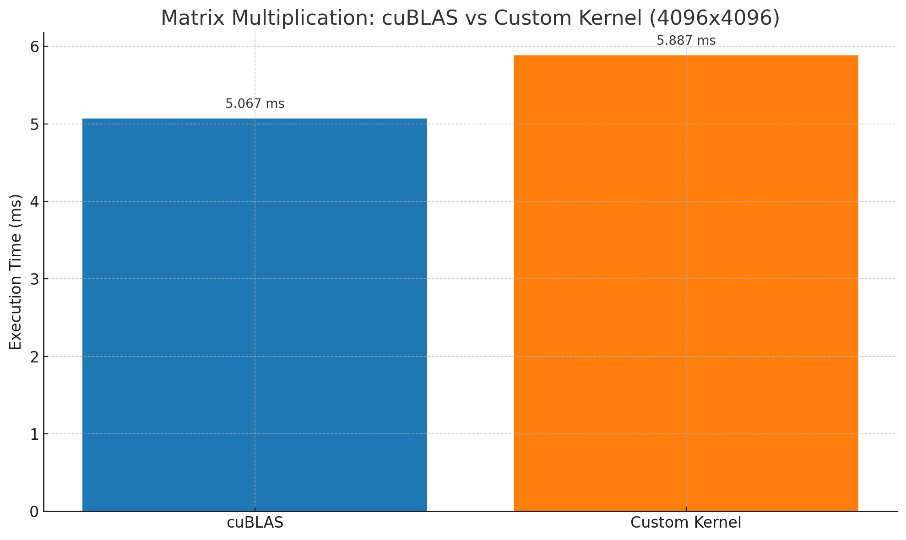

# GPU-Accelerated Matrix Multiplication (Almost Like cuBLAS)

This project implements high-performance matrix multiplication using **CUDA C**, mimicking the behavior of NVIDIA's **cuBLAS** library for a large matrix size: `4096 × 4096`.

> All benchmarks were run on an **NVIDIA L40S GPU (48GiB VRAM)** using **CUDA 12.0**, on **Brev.dev**, with 1 GPU, 8 CPU cores, and 147GiB system RAM.

---

## Overview

- Tiling with shared memory
- Thread coarsening (each thread computes 2 output elements)
- Memory coalescing

---

## 🔧 Matrix Setup

- Matrix A shape: `(4096 × 4096)`
- Matrix B shape: `(4096 × 4096)`
- Output Matrix C shape: `(4096 × 4096)`
- Block size: `32 x 64` threads
- TILE_WIDTH: `64`

---

## Performance Comparison

Matrix multiplication execution time on `4096x4096` matrices:

| Implementation | Time (ms) |
|----------------|-----------|
| cuBLAS         | 5.067     |
| Custom Kernel  | 5.887     |

### Benchmark Graph



---

## Optimizations Used

- **Tiling**: Shared memory tiles for reduced global memory access
- **Thread Coarsening**: Each thread computes two elements of output
- **Memory Coalescing**: Proper alignment and padding

---

## Optimization Tradeoffs 
- `float4`-based vectorized memory accesses were tested but **hurt performance** due to alignment constraints and uncoalesced memory access patterns.
- Loop unrolling added complexity with **no performance gain**, so was also removed.

---

## Build & Run

### Compile and run custom kernel
```bash
nvcc -o practising practising.cu
./practising
